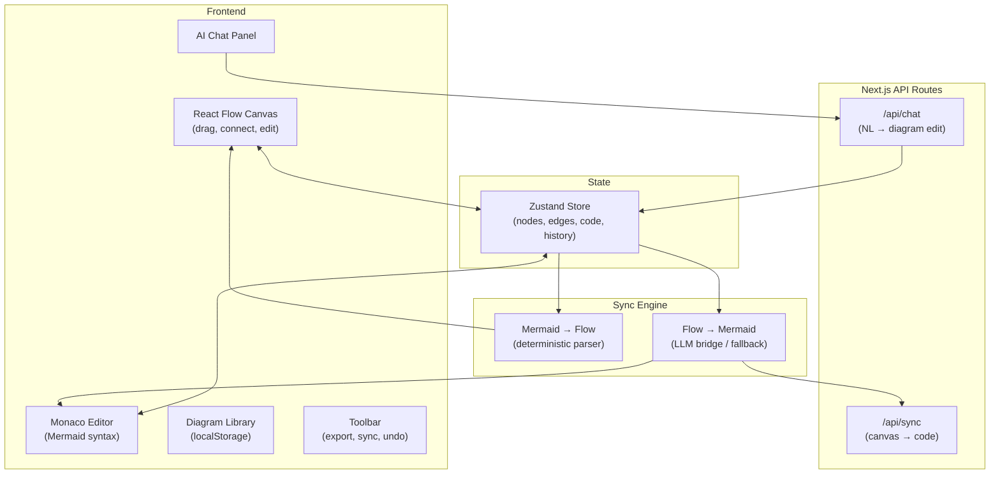

<div align="center">

# DiagramOS

**Mermaid diagrams, alive.**

A visual editor for Mermaid diagrams with bidirectional sync, AI-powered editing, and live architecture overlays.

[](LICENSE)
[](https://nextjs.org)
[](https://reactflow.dev)
[](https://typescriptlang.org)

[Demo](#) · [Features](#features) · [Quick Start](#quick-start) · [Architecture](#architecture) · [Contributing](#contributing)

</div>

---

## The Problem

Mermaid is everywhere — GitHub, Notion, Obsidian, GitLab all render it natively. **But everyone hates writing it by hand past ~20 nodes.** Existing tools are either code-only editors, one-way visual tools, or proprietary SaaS.

No tool today combines:
- ✅ Visual drag & drop editing
- ✅ Mermaid code as source of truth
- ✅ True bidirectional sync between visual and code
- ✅ AI-powered natural language editing
- ✅ Self-hostable, local-first, no account required

**DiagramOS fills this gap.**

## Features

### 🎨 Visual Canvas
Drag and drop nodes, connect edges, edit labels inline. Built on React Flow — the same library powering tools like Stripe, Zapier, and countless node-based UIs.

### 📝 Code Editor
Full Monaco editor (VS Code's engine) with Mermaid syntax highlighting, auto-complete, and bracket matching. Edit code directly and see changes on canvas instantly.

### 🔄 Bidirectional Sync
The killer feature. Edit on canvas → code updates. Edit code → canvas updates. Uses an LLM as the intelligent bridge for canvas-to-code translation, with a deterministic parser for the reverse direction.

### 🤖 AI Edit
Natural language diagram editing. Type "add a database between API and cache" and watch it happen. Powered by any OpenAI-compatible API.

### 📚 Diagram Library
Manage multiple diagrams. Create from templates (flowchart, sequence, class, state, ER). Search, rename, delete. All stored locally.

### 📦 Export
PNG, SVG, `.mmd` file, or copy Mermaid code to clipboard. One click.

### ⌨️ Keyboard First
- `⌘B` — Toggle sidebar
- `⌘K` — AI chat
- `⌘Z` / `⌘⇧Z` — Undo / Redo
- `⌘S` — Save
- `Delete` — Remove selected nodes

## Quick Start

```bash
# Clone
git clone https://github.com/fl-satyakam/diagramos.git
cd diagramos

# Install
npm install

# Run
npm run dev
```

Open [http://localhost:3000](http://localhost:3000).

**That's it.** No API keys needed for the visual editor. Add an OpenAI key in `.env.local` to enable AI features:

```env
OPENAI_API_KEY=sk-your-key-here
```

## Architecture



## Tech Stack

| Layer | Technology |
|-------|-----------|
| Framework | Next.js 15 (App Router) |
| Canvas | React Flow (@xyflow/react) |
| Code Editor | Monaco Editor |
| Diagrams | Mermaid.js |
| State | Zustand |
| UI | shadcn/ui + Tailwind CSS |
| AI | OpenAI API (any compatible provider) |
| Export | html-to-image |

## Design Philosophy

- **Minimalistic.** Black, white, gray. No visual noise. Think Linear, Vercel, Raycast.
- **Local-first.** Everything works offline. No account. No cloud dependency.
- **Mermaid-native.** Mermaid code is the source of truth. Always portable, always git-friendly.
- **LLM as bridge, not crutch.** The editor works fully without AI. LLM enhances the experience.

## Roadmap

- [x] Visual canvas with React Flow
- [x] Monaco code editor with Mermaid syntax
- [x] Bidirectional sync (code ↔ canvas)
- [x] Diagram library with templates
- [x] Export (PNG, SVG, .mmd, clipboard)
- [x] AI chat editing
- [ ] Live architecture overlays (health probes, metrics)
- [ ] Auto-generate from Docker Compose / Terraform / K8s
- [ ] Collaborative real-time editing
- [ ] Node commenting & annotations
- [ ] Version history / git sync
- [ ] WorkOS auth integration
- [ ] Plugin system

## Project Structure

```
diagramos/
├── app/
│   ├── layout.tsx           # Root layout (dark theme)
│   ├── page.tsx             # Main SPA page
│   └── api/
│       ├── sync/route.ts    # Canvas → Code sync API
│       └── chat/route.ts    # AI chat API
├── components/
│   ├── canvas/              # React Flow canvas + custom nodes/edges
│   ├── editor/              # Monaco code editor
│   ├── sidebar/             # Diagram library
│   ├── chat/                # AI chat panel
│   ├── toolbar/             # Main toolbar
│   └── ui/                  # shadcn components
├── lib/
│   ├── store.ts             # Zustand state management
│   └── sync/
│       ├── mermaid-to-flow.ts   # Parser (deterministic)
│       ├── flow-to-mermaid.ts   # LLM bridge + fallback
│       └── sync-engine.ts       # Orchestrator
└── public/
```

## Deploy

### Vercel (recommended)

[](https://vercel.com/new/clone?repository-url=https://github.com/fl-satyakam/diagramos)

### Self-host

```bash
npm run build
npm start
```

Set `OPENAI_API_KEY` as environment variable for AI features.

## Contributing

1. Fork the repo
2. Create a branch (`git checkout -b feature/amazing-feature`)
3. Commit (`git commit -m 'Add amazing feature'`)
4. Push (`git push origin feature/amazing-feature`)
5. Open a PR

## License

MIT — do whatever you want with it.

---

<div align="center">

Built by [Satyakam](https://github.com/fl-satyakam) · Powered by [Vex](https://github.com/fl-satyakam/diagramos) ⚡

</div>
