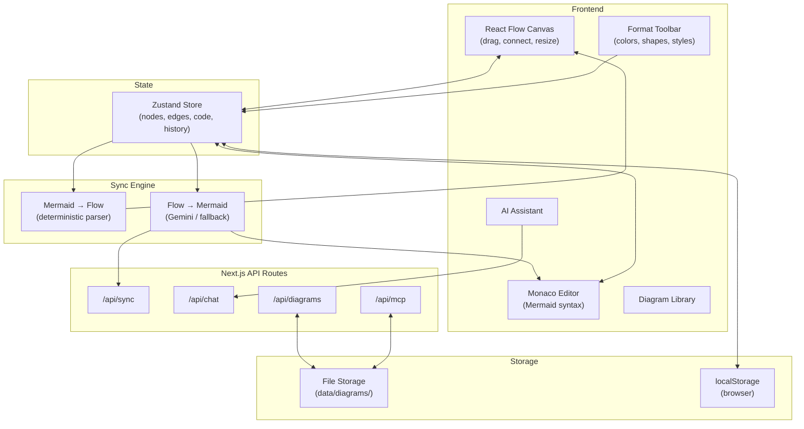

<div align="center">

# DiagramOS

**Mermaid diagrams, alive.**

A visual editor for Mermaid diagrams with bidirectional sync, AI-powered editing, MCP server, and a Miro/FigJam-style canvas experience.

[](LICENSE)
[](https://nextjs.org)
[](https://reactflow.dev)
[](https://typescriptlang.org)
[](https://modelcontextprotocol.io)

[Features](#features) · [Quick Start](#quick-start) · [MCP Server](#mcp-server) · [REST API](#rest-api) · [Architecture](#architecture)

</div>

---

## The Problem

Mermaid is everywhere — GitHub, Notion, Obsidian, GitLab all render it natively. **But everyone hates writing it by hand past ~20 nodes.** Existing tools are either code-only editors, one-way visual tools, or proprietary SaaS.

No tool today combines:
- ✅ Visual drag & drop editing with Miro/FigJam-style tooling
- ✅ Mermaid code as source of truth
- ✅ Bidirectional sync between visual and code
- ✅ AI-powered natural language editing
- ✅ MCP server for tool integration
- ✅ Self-hostable, local-first, no account required

**DiagramOS fills this gap.**

## Features

### 🎨 Visual Canvas
Drag and drop nodes, connect with curved Bezier edges, resize nodes, edit labels inline. Double-click edges to add labels (FigJam-style). Built on React Flow.

### 🎯 Formatting Toolbar
Select nodes or edges to get a floating format bar — change colors (8 pastel presets), shapes (rect/round/diamond/pill), border styles, edge thickness. Like Miro but for diagrams.

### 💬 Comment Nodes
Sticky-note style comments that collapse when unfocused and expand on click. Great for annotations and documentation.

### 📝 Code Editor
Full Monaco editor (VS Code's engine) with Mermaid syntax highlighting, auto-complete, and bracket matching.

### 🔄 Manual Sync
No auto-sync chaos. Work freely on canvas or code, then sync when ready:
- **Code → Canvas**: Parse Mermaid and render on canvas
- **Canvas → Code**: Convert visual nodes to Mermaid (AI-powered with deterministic fallback)
- Smart save indicator: 🟢 green = synced, 🟠 orange = unsaved changes

### 🤖 AI Assistant
Conversational AI that can both **answer questions** about your diagram and **edit it** via natural language. Powered by Gemini (primary), with Anthropic and OpenAI fallbacks.

### 🔌 MCP Server
Any MCP-compatible tool (Claude Desktop, Cursor, Cline, OpenClaw, etc.) can store and retrieve diagrams via the built-in MCP endpoint.

### 📡 REST API
Full CRUD API for programmatic diagram management.

### 📚 Diagram Library
Manage multiple diagrams. Create from templates (flowchart, sequence, class, state, ER). Search, rename, delete. Stored in localStorage + server-side file storage.

### 📦 Export
PNG, SVG, `.mmd` file, or copy Mermaid code to clipboard.

### ⌨️ Keyboard Shortcuts
- `⌘B` — Toggle sidebar
- `⌘K` — AI chat
- `⌘Z` / `⌘⇧Z` — Undo / Redo
- `⌘S` — Save
- `Delete` — Remove selected nodes
- Double-click node — Edit label
- Double-click edge — Edit edge label

## Quick Start

```bash
# Clone
git clone https://github.com/fl-satyakam/diagramos.git
cd diagramos

# Install
npm install

# Run
npm run dev
```

Open [http://localhost:3000](http://localhost:3000).

**That's it.** No API keys needed for the visual editor. Add a Gemini key in `.env.local` to enable AI features:

```env
# AI Features (pick one or more — priority: Gemini → Anthropic → OpenAI)
GEMINI_API_KEY=your-key-here
# ANTHROPIC_API_KEY=sk-ant-your-key
# OPENAI_API_KEY=sk-your-key
```

## MCP Server

DiagramOS includes a built-in MCP (Model Context Protocol) server that any AI tool can connect to.

### Endpoint

```
POST http://localhost:3000/api/mcp
```

Transport: **Streamable HTTP** (JSON-RPC 2.0)

### Available Tools

| Tool | Description |
|------|-------------|
| `diagramos_list` | List all saved diagrams (id, name, updatedAt, tags) |
| `diagramos_get` | Get a diagram by `id` or `name` (case-insensitive) |
| `diagramos_save` | Save/update a diagram (`name`, `mermaidCode`, optional `tags`) |
| `diagramos_delete` | Delete a diagram by `id` |

### Connect from Claude Desktop

Add to your `claude_desktop_config.json`:

```json
{
  "mcpServers": {
    "diagramos": {
      "url": "http://localhost:3000/api/mcp"
    }
  }
}
```

### Connect from Cursor / Cline

Add to your MCP settings:

```json
{
  "diagramos": {
    "url": "http://localhost:3000/api/mcp",
    "transport": "streamable-http"
  }
}
```

### Example: Save a diagram via MCP

```json
{
  "jsonrpc": "2.0",
  "id": 1,
  "method": "tools/call",
  "params": {
    "name": "diagramos_save",
    "arguments": {
      "name": "Auth Flow",
      "mermaidCode": "graph TD\n    A[Login] --> B{Valid?}\n    B -->|Yes| C[Dashboard]\n    B -->|No| D[Error]",
      "tags": ["auth", "example"]
    }
  }
}
```

### Example: Fetch a diagram by name

```json
{
  "jsonrpc": "2.0",
  "id": 2,
  "method": "tools/call",
  "params": {
    "name": "diagramos_get",
    "arguments": {
      "name": "Auth Flow"
    }
  }
}
```

### Discovery

```bash
# Get server info + tool list
curl http://localhost:3000/api/mcp
```

## REST API

For direct HTTP integration without MCP:

### List diagrams
```bash
GET /api/diagrams
```

### Get by ID or name
```bash
GET /api/diagrams?id=auth-flow
GET /api/diagrams?name=Auth%20Flow
```

### Create/update
```bash
POST /api/diagrams
Content-Type: application/json

{
  "name": "Auth Flow",
  "mermaidCode": "graph TD\n    A[Login] --> B[Dashboard]",
  "tags": ["auth"]
}
```

### Delete
```bash
DELETE /api/diagrams?id=auth-flow
```

## Architecture



## Tech Stack

| Layer | Technology |
|-------|-----------|
| Framework | Next.js 15 (App Router, Turbopack) |
| Canvas | React Flow (@xyflow/react) |
| Code Editor | Monaco Editor |
| Diagrams | Mermaid.js |
| State | Zustand |
| UI | shadcn/ui + Tailwind CSS |
| Font | Montserrat |
| AI | Gemini 2.5 Flash (primary), Claude, GPT-4o-mini |
| MCP | JSON-RPC 2.0 / Streamable HTTP |
| Storage | File system + localStorage |
| Export | html-to-image |

## Project Structure

```
diagramos/
├── app/
│   ├── layout.tsx              # Root layout (Montserrat, light mode)
│   ├── page.tsx                # Main SPA page
│   ├── globals.css             # Theme + fonts
│   └── api/
│       ├── chat/route.ts       # AI chat (Gemini → Anthropic → OpenAI)
│       ├── sync/route.ts       # Canvas → Code sync
│       ├── diagrams/route.ts   # REST API (CRUD)
│       └── mcp/route.ts        # MCP server (JSON-RPC 2.0)
├── components/
│   ├── canvas/
│   │   ├── DiagramCanvas.tsx   # React Flow wrapper
│   │   ├── CustomNode.tsx      # Resizable, colorable nodes
│   │   ├── CustomEdge.tsx      # Bezier curves, editable labels
│   │   └── CommentNode.tsx     # Collapsible sticky-note comments
│   ├── editor/CodeEditor.tsx   # Monaco with Mermaid language
│   ├── sidebar/DiagramLibrary.tsx
│   ├── chat/AIChatPanel.tsx    # Conversational AI
│   ├── toolbar/
│   │   ├── Toolbar.tsx         # Main toolbar + smart save
│   │   └── FormatToolbar.tsx   # Node/edge formatting (Miro-style)
│   └── ui/                     # shadcn components
├── lib/
│   ├── store.ts                # Zustand (nodes, edges, styles, history)
│   ├── storage.ts              # Server-side file storage
│   └── sync/
│       ├── mermaid-to-flow.ts  # Deterministic parser
│       ├── flow-to-mermaid.ts  # LLM bridge + fallback
│       └── sync-engine.ts      # Manual sync orchestrator
├── data/diagrams/              # Saved diagrams (gitignored)
└── .env.local                  # API keys (gitignored)
```

## Deploy

### Vercel (recommended)

[](https://vercel.com/new/clone?repository-url=https://github.com/fl-satyakam/diagramos)

Set `GEMINI_API_KEY` (or `ANTHROPIC_API_KEY` / `OPENAI_API_KEY`) as environment variables for AI features.

> **Note**: File storage (`/api/diagrams`, `/api/mcp`) uses the local filesystem, which is ephemeral on Vercel. For persistent storage on Vercel, swap `lib/storage.ts` with a database adapter (e.g., Vercel KV, Supabase, Postgres).

### Self-host

```bash
npm run build
npm start
```

### Docker

```dockerfile
FROM node:20-slim
WORKDIR /app
COPY . .
RUN npm ci && npm run build
EXPOSE 3000
CMD ["npm", "start"]
```

## Contributing

1. Fork the repo
2. Create a branch (`git checkout -b feature/amazing-feature`)
3. Commit (`git commit -m 'Add amazing feature'`)
4. Push (`git push origin feature/amazing-feature`)
5. Open a PR

## License

MIT — do whatever you want with it.

---

<div align="center">

Built by [Satyakam](https://github.com/fl-satyakam) ⚡

</div>
